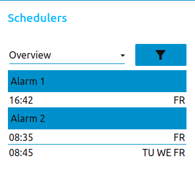
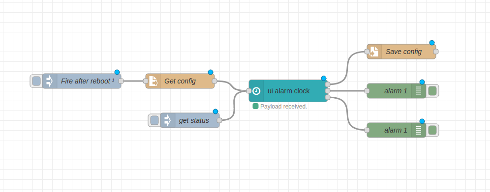

# node-red-contrib-ui-alarm-clock
A node-red-ui alarm clock for the Node-RED Dashboard.  

Based on the awesome [node-red-contrib-ui-time-scheduler
](https://github.com/fellinga/node-red-contrib-ui-time-scheduler)

## Install
  
You can install this node directly from the "Manage Palette" menu in the Node-RED interface.  
Alternatively, run the following command in your Node-RED user directory - typically `~/.node-red` on Linux or `%HOMEPATH%\.nodered` on Windows

        npm install node-red-contrib-ui-alarm-clock

### Requirements ###
node-red v0.19 or above  
node-red-dashboard v2.10.0 (v2.15.4 or above would be ideal)
  
## Usage
  
Add a alarm-clock-node to your flow. Open the dashboard, you will see an empty list.
Click the plus sign at the top right corner of the node to create a new timer.
  
### Input
  
You can inject timers via a msg property `payload` (see [restoring schedules after a reboot](#Restoring-schedules-after-a-reboot) section). If the injected msg has a property `disableAlarm` or `enableAlarm` the node will disable/enable the alarms output. Disabling/enabling works both with alarm name and index.
If you inject `getStatus` you can get the next trigger for each alarm (epoch).
  
### Output
  
Whenever you add, edit or delete a timer a JSON string is sent to the nodes top output. This JSON string contains all timers and settings.

Every other output (number of total outputs depends on how many alarms you have added) emits true once an alarm is triggered. Adjusting the refresh rate is possible within the node's options.

### Restoring schedules after a reboot
  
You can use the JSON string from the nodes top output to directly inject timers after a (re)boot or (re)deploy. See `examples` dir.

If you changed the node-red <a target="blank" href="https://nodered.org/docs/user-guide/context#context-stores">contextStorage to localfilesystem</a>, timers are automatically saved and restored after a reboot.

  
## History
  
Find the changelog [here](CHANGELOG.md).

